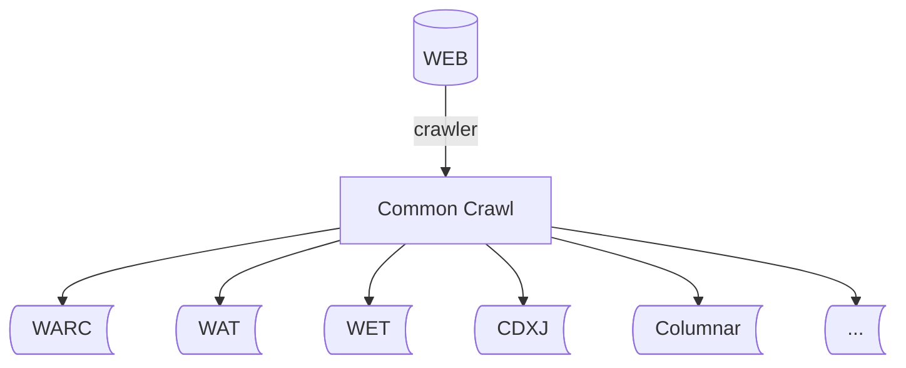
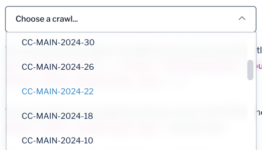
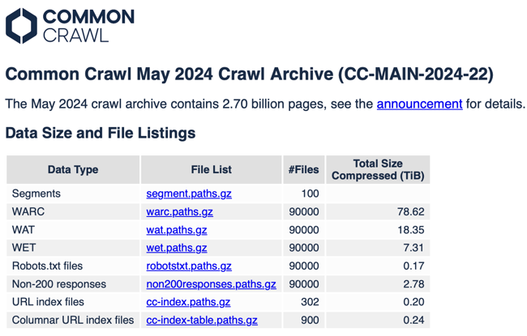
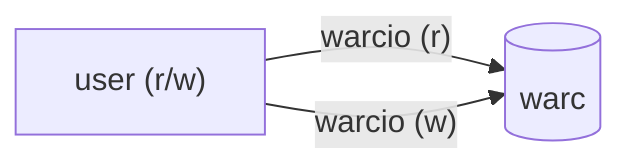
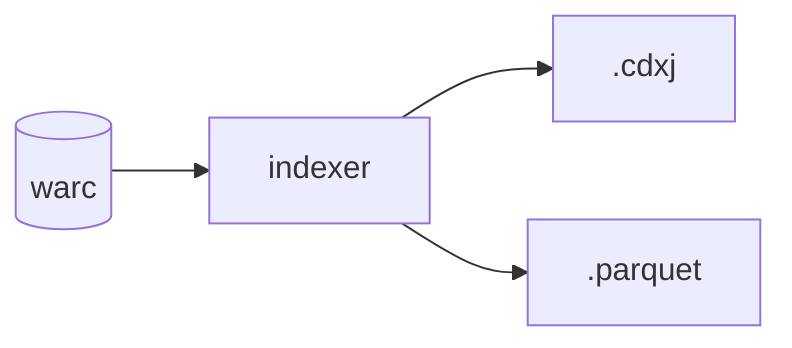
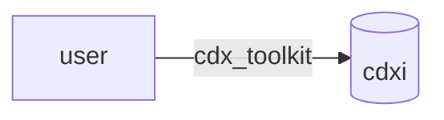
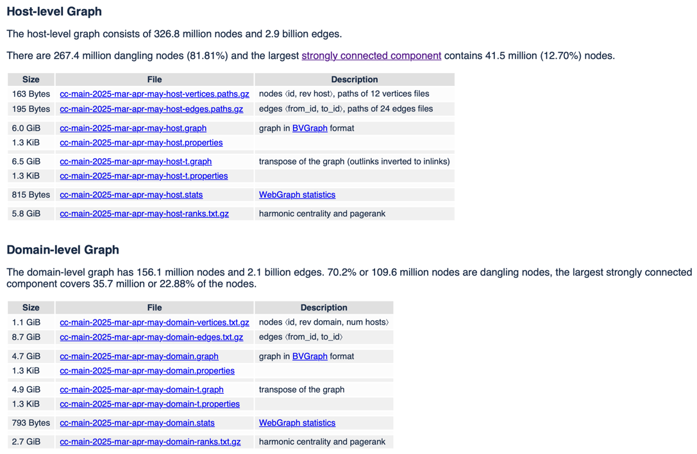

# Whirlwind Tour of Common Crawl's Datasets using Python

The Common Crawl corpus contains petabytes of crawl data, including raw web page data, metadata extracts, and text extracts. Common Crawl's data storage is a little complicated, as you might expect for such a large and rich dataset. We make our crawl data available in a variety of formats (WARC, WET, WAT) and we also have two index files of the crawled webpages: CDXJ and columnar.


The goal of this whirlwind tour is to show you how a single webpage appears in all of these different places. That webpage is [https://an.wikipedia.org/wiki/Escopete](https://an.wikipedia.org/wiki/Escopete), which we crawled on the date 2024-05-18T01:58:10Z. On the way, we'll also explore the file formats we use and learn about some useful tools for interacting with our data!

In the Whirlwind Tour, we will:
1) explore the WARC, WET and WAT file formats used to store Common Crawl's data.
2) play with some useful Python packages for interacting with the data: [warcio](https://github.com/webrecorder/warcio), [cdxj-indexer](https://github.com/webrecorder/cdxj-indexer), 
[cdx_toolkit](https://github.com/cocrawler/cdx_toolkit),
and [duckdb](https://duckdb.org/).
3) learn about how the data is compressed to allow random access.
4) use the CDXJ index and the columnar index to access the data we want.

**Prerequisites:** To get the most out of this tour, you should be comfortable with Python3, running commands on the command line, and basic SQL. Some knowledge of HTTP requests and HTML is also helpful but not essential. We assume you have [make](https://www.gnu.org/software/make/) and [virtualenv](https://pypi.org/project/virtualenv/) installed.

We use a [Makefile](https://makefiletutorial.com) to provide many of the commands needed to run this tutorial. To see what commands are being run, open the `Makefile` and find the relevant target: e.g. `make install` runs `pip install -r requirements.txt`.

Let's get started!

## Task 0: Set-up

This tutorial was written on Linux and MacOS and it should also work on Windows. If you encounter any problems, please raise an issue.

### Clone the repository and create a local Python environment

First, [clone this repository](https://docs.github.com/en/repositories/creating-and-managing-repositories/cloning-a-repository) to create a local copy, then navigate to the `whirlwind-python` directory on your computer.

In general, it's a good idea to set up separate virtual environments (venvs) for Python projects. This lets you install packages without changing either the system Python environment or any of your other Python projects. 

If you already have your own favorite venv scheme, you can skip this step (we used the [Pycharm IDE](https://www.jetbrains.com/pycharm) to manage environment creation). Otherwise, you can create a venv on the command line by running:

```make venv```

After you create this venv, you'll need to activate it:

```source ~/venv/whirlwind/bin/activate```

On many systems, you will now see the name of the venv in parentheses before the command prompt. You'll need to activate the environment again if you log out and log in again.  

Next, let's install the necessary software for this tour:

```make install```

This command will print out a screen-full of output and install the Python packages in `requirements.txt` to your venv.

### Install and configure AWS-CLI

We will use the AWS Command Line Interface (CLI) later in the tour to access the data stored in Common Crawl's S3 bucket. Instructions on how to install the AWS-CLI and configure your account are available on the [AWS website](https://docs.aws.amazon.com/cli/latest/userguide/getting-started-install.html). 

## Task 1: Look at the crawl data

Common Crawl's website includes a [Get Started](https://commoncrawl.org/get-started) guide which summarises different ways to access the data and the file formats. We can use the dropdown menu to access the links for downloading crawls over HTTP(S):



If we click on `CC-MAIN-2024-22' in the dropdown, we are taken to a page listing the files contained in this crawl: 



In this whirlwind tour, we're going to look at the WARC, WET, and WAT files: the data types which store the crawl data. Later, we will look at the two index files and how these help us access the crawl data we want. At the [end of the Tour](#other-datasets), we'll mention some of Common Crawl's other datasets and where you can find more information about them.

### WARC

[WARC files](https://iipc.github.io/warc-specifications/specifications/warc-format/warc-1.0/) are a container that holds files, similar to zip and tar files. It's the standard data format used by archiving
community and we use it to store raw crawl data. As you can see in the file listing above, our WARC files are very large even when compressed! Luckily, we have a much smaller example to look at. 

Open `whirlwind.warc` in your favorite text editor. Note that this is an uncompressed version of the file; normally we always work with these files while they are compressed. This is the WARC corresponding to the single webpage we mentioned in the introduction.

You'll see four records total, with the start of each record marked with the header `WARC/1.0` followed by metadata related to that particular record. The `WARC-Type` field tells you the type of each record. In our WARC file, we have:
1) a `warcinfo` record. Every WARC has that at the start. 
2) the `request` to the webserver, with its HTTP headers.
3) the `response` from the webserver, with its HTTP headers followed by the html.
4) a `metadata` record related to the HTTP response.

### WET

WET (WARC Encapsulated Text) files only contain the body text of web pages extracted from the HTML and exclude any HTML code, images, or other media. This makes them useful for text analysis and natural language processing (NLP) tasks.

Open `whirlwind.warc.wet`: this is the WET derived from our original WARC. We can see that it's still in WARC format with two records: 
1) a `warcinfo` record.
2) a `conversion` record: the extracted text with the HTTP headers removed.

### WAT

WAT (Web ARChive Timestamp) files contain metadata associated with the crawled web pages (e.g. parsed data from the HTTP response headers, links extracted from HTML pages, server response codes etc.). They are useful for analysis that requires understanding the structure of the web.

Open `whirlwind.warc.wat`: this is the WAT derived from our original WARC. Like the WET file, it's also in WARC format. It contains two records:
1) a `warcinfo` record.
2) a `metadata` record: there should be one for each response in the WARC. The metadata is stored as JSON. 

You might want to feed the JSON into a pretty-printer to read it more easily. For example, you can save just the json into a file and use `python -m json.tool FILENAME` to pretty-print it.

Now that we've looked at the uncompressed versions of these files to understand their structure, we'll be interacting with compressed WARC, WET, and WAT files for the rest of this tour. This is the usual way we manipulate this data with software tools due to the size of the files.

## Task 2: Iterate over WARC, WET, and WAT files

The [warcio](https://github.com/webrecorder/warcio) Python library lets us read and write WARC files programmatically.

Let's use it to iterate over our WARC, WET, and WAT files and print out the record types we looked at before. First, look at the code in `warcio-iterator.py`:

<details>
  <summary>Click to view code</summary>

```python
'''Generic example iterator, similar to what's in the warcio README.'''

import sys

from warcio.archiveiterator import ArchiveIterator

for file in sys.argv[1:]:
    with open(file, 'rb') as stream:
        for record in ArchiveIterator(stream):
            print(' ', 'WARC-Type:', record.rec_type)
            if record.rec_type in {'request', 'response', 'conversion', 'metadata'}:
                print('   ', 'WARC-Target-URI', record.rec_headers.get_header('WARC-Target-URI'))
```
</details>

The `ArchiveIterator` reads the WARC content in a single pass and allows us to access the attributes of each record (e.g. the record type through `record.rec_type`).

Now run: 

`make iterate` 

This will run `warcio-iterator.py` on `whirlwind.warc.gz`, `whirlwind.warc.wet.gz`, and `whirlwind.warc.wat.gz` in turn. You should see output like the following:

<details>
  <summary>Click to view output</summary>

```
iterating over all of the local warcs:

warc:
python ./warcio-iterator.py whirlwind.warc.gz
  WARC-Type: warcinfo
  WARC-Type: request
    WARC-Target-URI https://an.wikipedia.org/wiki/Escopete
  WARC-Type: response
    WARC-Target-URI https://an.wikipedia.org/wiki/Escopete
  WARC-Type: metadata
    WARC-Target-URI https://an.wikipedia.org/wiki/Escopete

wet:
python ./warcio-iterator.py whirlwind.warc.wet.gz
  WARC-Type: warcinfo
  WARC-Type: conversion
    WARC-Target-URI https://an.wikipedia.org/wiki/Escopete

wat:
python ./warcio-iterator.py whirlwind.warc.wat.gz
  WARC-Type: warcinfo
  WARC-Type: metadata
    WARC-Target-URI https://an.wikipedia.org/wiki/Escopete
```
</details>

The output has three sections, one each for the WARC, WET, and WAT. For each one, it prints the record types we saw before, plus the `WARC-Target-URI` for those record types that have it.

## Task 3: Index the WARC, WET, and WAT

The example WARC files we've been using are tiny and easy to work with. The real WARC files are around a gigabyte in size and contain about 30,000 webpages each. What's more, we have around 24 million of these files! To read all of them, we could iterate, but what if we wanted random access so we could read just one particular record? We do that with an index. 



We have two versions of the index: the CDX index and the columnar index. The CDX index is useful for looking up single pages, whereas the columnar index is better suited to analytical and bulk queries. We'll look at both in this tour, starting with the CDX index.

### CDX(J) index

The CDX index files are sorted plain-text files, with each line containing information about a single capture in the WARC. Technically, Common Crawl uses CDXJ index files since the information about each capture is formatted as JSON. We'll use CDX and CDXJ interchangeably in this tour for legacy reasons 💅

We can create our own CDXJ index from the local WARCs by running:

```make cdxj```

This uses the [cdxj-indexer](https://github.com/webrecorder/cdxj-indexer) library to generate CDXJ index files for our WARC files by running the code below: 

<details>
  <summary>Click to view code</summary>

```
creating *.cdxj index files from the local warcs
cdxj-indexer whirlwind.warc.gz > whirlwind.warc.cdxj
cdxj-indexer --records conversion whirlwind.warc.wet.gz > whirlwind.warc.wet.cdxj
cdxj-indexer whirlwind.warc.wat.gz > whirlwind.warc.wat.cdxj
```

</details>

Now look at the `.cdxj` files with `cat whirlwind*.cdxj`. You'll see that each file has one entry in the index. The WARC only has the response record indexed, since by default cdxj-indexer guesses that you won't ever want to random-access the request or metadata. WET and WAT have the conversion and metadata records indexed (Common Crawl doesn't publish a WET or WAT index, just WARC).

For each of these records, there's one text line in the index - yes, it's a flat file! It starts with a string like `org,wikipedia,an)/wiki/escopete 20240518015810`, followed by a JSON blob. The starting string is the primary key of the index. The first thing is a [SURT](http://crawler.archive.org/articles/user_manual/glossary.html#surt) (Sort-friendly URI Reordering Transform). The big integer is a date, in ISO-8601 format with the delimiters removed.

What is the purpose of this funky format? It's done this way because these flat files (300 gigabytes total per crawl) can be sorted on the primary key using any out-of-core sort utility e.g. the standard Linux `sort`, or one of the Hadoop-based out-of-core sort functions.

The JSON blob has enough information to extract individual records: it says which warc file the record is in, and the offset and length of the record. We'll use that in the next section.

## Task 4: Use the CDXJ index to extract raw content from the local WARC, WET, and WAT 

Normally, compressed files aren't random access. However, the WARC files use a trick to make this possible, which is that every record needs to be separately compressed. The `gzip` compression utility supports this, but it's rarely used.

To extract one record from a warc file, all you need to know is the filename and the offset into the file. If you're reading over the web, then it really helps to know the exact length of the record.

Run:

```make extract```

to run a set of extractions from your local
`whirlwind.*.gz` files with `warcio` using the code below:

<details>
  <summary>Click to view code</summary>

```
creating extraction.* from local warcs, the offset numbers are from the cdxj index
warcio extract --payload whirlwind.warc.gz 1023 > extraction.html
warcio extract --payload whirlwind.warc.wet.gz 466 > extraction.txt
warcio extract --payload whirlwind.warc.wat.gz 443 > extraction.json
hint: python -m json.tool extraction.json
```

</details>

The offset numbers in the Makefile are the same
ones as in the index. Look at the three output files: `extraction.html`, `extraction.txt`, and `extraction.json` (pretty-print the json with `python -m json.tool extraction.json`). 

Notice that we extracted HTML from the WARC, text from WET, and JSON from the WAT (as shown in the different file extensions). This is because the payload in each file type is formatted differently!

## Task 5: Wreck the WARC by compressing it wrong

As mentioned earlier, WARC/WET/WAT files look like they're gzipped, but they're actually gzipped in a particular way that allows random access. This means that you can't `gunzip` and then `gzip` a warc without wrecking random access. This example:

* creates a copy of one of the warc files in the repo
* uncompresses it
* recompresses it the wrong way
* runs `warcio-iterator` over it to show that it triggers an error
* recompresses it the right way using `warcio recompress`
* shows that this compressed file works

Run

```make wreck_the_warc```

and read through the output. You should get something like the output below:

<details>
  <summary>Click to view output</summary>

```
we will break and then fix this warc
cp whirlwind.warc.gz testing.warc.gz
rm -f testing.warc
gunzip testing.warc.gz

iterate over this uncompressed warc: works
python ./warcio-iterator.py testing.warc
  WARC-Type: warcinfo
  WARC-Type: request
    WARC-Target-URI https://an.wikipedia.org/wiki/Escopete
  WARC-Type: response
    WARC-Target-URI https://an.wikipedia.org/wiki/Escopete
  WARC-Type: metadata
    WARC-Target-URI https://an.wikipedia.org/wiki/Escopete

compress it the wrong way
gzip testing.warc

iterating over this compressed warc fails
python ./warcio-iterator.py testing.warc.gz || /usr/bin/true
  WARC-Type: warcinfo
Traceback (most recent call last):
  File "/home/ccgreg/github/whirlwind-python/./warcio-iterator.py", line 9, in <module>
    for record in ArchiveIterator(stream):
  File "/home/ccgreg/venv/whirlwind/lib/python3.10/site-packages/warcio/archiveiterator.py", line 112, in _iterate_records
    self._raise_invalid_gzip_err()
  File "/home/ccgreg/venv/whirlwind/lib/python3.10/site-packages/warcio/archiveiterator.py", line 153, in _raise_invalid_gzip_err
    raise ArchiveLoadFailed(msg)
warcio.exceptions.ArchiveLoadFailed:
    ERROR: non-chunked gzip file detected, gzip block continues
    beyond single record.

    This file is probably not a multi-member gzip but a single gzip file.

    To allow seek, a gzipped WARC must have each record compressed into
    a single gzip member and concatenated together.

    This file is likely still valid and can be fixed by running:

    warcio recompress <path/to/file> <path/to/new_file>


now let's do it the right way
gunzip testing.warc.gz
warcio recompress testing.warc testing.warc.gz
4 records read and recompressed to file: testing.warc.gz
No Errors Found!

and now iterating works
python ./warcio-iterator.py testing.warc.gz
  WARC-Type: warcinfo
  WARC-Type: request
    WARC-Target-URI https://an.wikipedia.org/wiki/Escopete
  WARC-Type: response
    WARC-Target-URI https://an.wikipedia.org/wiki/Escopete
  WARC-Type: metadata
    WARC-Target-URI https://an.wikipedia.org/wiki/Escopete
```

</details>

Make sure you compress WARCs the right way!

## Task 6: Use cdx_toolkit to query the full CDX index and download those captures from AWS S3

Some of our users only want to download a small subset of the crawl. They want to run queries against an index, either the CDX index we just talked about, or in the columnar index, which we'll talk about later.



The [cdx_toolkit](https://github.com/cocrawler/cdx_toolkit) is a set of tools for working with CDX indices of web crawls and archives. It knows how to query the CDX index across all of our crawls and also can create WARCs of just the records you want. We will fetch the same record from Wikipedia that we've been using for the whirlwind tour.

Run

```make cdx_toolkit```

The output looks like this:

<details>
  <summary>Click to view output</summary>

```
look up this capture in the comoncrawl cdx index
cdxt --cc --from 20240518015810 --to 20240518015810 iter an.wikipedia.org/wiki/Escopete
status 200, timestamp 20240518015810, url https://an.wikipedia.org/wiki/Escopete

extract the content from the commoncrawl s3 bucket
rm -f TEST-000000.extracted.warc.gz
cdxt --cc --from 20240518015810 --to 20240518015810 warc an.wikipedia.org/wiki/Escopete

index this new warc
cdxj-indexer TEST-000000.extracted.warc.gz  > TEST-000000.extracted.warc.cdxj
cat TEST-000000.extracted.warc.cdxj
org,wikipedia,an)/wiki/escopete 20240518015810 {"url": "https://an.wikipedia.org/wiki/Escopete", "mime": "text/html", "status": "200", "digest": "sha1:RY7PLBUFQNI2FFV5FTUQK72W6SNPXLQU", "length": "17455", "offset": "379", "filename": "TEST-000000.extracted.warc.gz"}

iterate this new warc
python ./warcio-iterator.py TEST-000000.extracted.warc.gz
  WARC-Type: warcinfo
  WARC-Type: response
    WARC-Target-URI https://an.wikipedia.org/wiki/Escopete
```

</details>

We look up the capture using the `cdxt` commands by specifying the exact URL (`an.wikipedia.org/wiki/Escopete`) and the date of its capture (20240518015810). The output is the WARC file `TEST-000000.extracted.warc.gz` which contains a `warcinfo` record explaining what the WARC is, followed by the `response` record we requested. The Makefile target then runs `cdxj-indexer` on this new WARC to make a CDXJ index of it as in Task 3, and finally iterates over the WARC using `warcio-iterator.py` as in Task 2.

If you dig into cdx_toolkit's code, you'll find that it is using the offset and length of the WARC record, as returned by the CDX index query, to make a HTTP byte range request to S3 to download the single WARC record we want. It only downloads the response WARC record because our CDX index only has the response records indexed.

## Task 7: Find the right part of the columnar index 

Now let's look at the columnar index, the other kind of index that Common Crawl makes available. This index is stored in parquet files so you can access it using SQL-based tools like AWS Athena and duckdb as well as through tables in your favorite table packages such as pandas, pyarrow, and polars.

We could read the data directly from our index in our S3 bucket and analyse it in the cloud through AWS Athena. However, this is a managed service that costs money to use (though usually a small amount). [You can read about using it here.](https://commoncrawl.org/blog/index-to-warc-files-and-urls-in-columnar-format) This whirlwind tour will only use the free method of either fetching data from outside of AWS (which is kind of slow), or making a local copy of a single columnar index (300 gigabytes per monthly crawl), and then using that.

The columnar index is divided up into a separate index per crawl, which Athena or duckdb can stitch together. The cdx index is similarly divided up, but cdx_toolkit hides that detail from you.

For the purposes of this whirlwind tour, we don't want to configure all the crawl indices because it would be slow. So let's start by figuring out which crawl was ongoing on the date 20240518015810, and then we'll work with just that one crawl.

### Downloading collinfo.json

We're going to use the `collinfo.json` file to find out which crawl we want. This file includes the dates for the start and end of every crawl and is available through the Common Crawl website at [index.commoncrawl.org](https://index.commoncrawl.org). To download it, run:

```make download_collinfo```

The output should look like:

<details>
  <summary>Click to view output</summary>

```
downloading collinfo.json so we can find out the crawl name
curl -O https://index.commoncrawl.org/collinfo.json
  % Total    % Received % Xferd  Average Speed   Time    Time     Time  Current
                                 Dload  Upload   Total   Spent    Left  Speed
100 30950  100 30950    0     0  75467      0 --:--:-- --:--:-- --:--:-- 75487
```

</details>

The date of our test record is 20240518015810, which is
2024-05-18T01:58:10 if you add the delimiters back in. We can scroll through the records in `collinfo.json` and look at the from/to values to find the right crawl: CC-MAIN-2024-22. Now we know the crawl name, we can access the correct fraction of the index without having to read the metadata of all the rest.

## Task 8: Query using the columnar index + DuckDB from outside AWS

A single crawl columnar index is around 300 gigabytes. If you don't have a lot of disk space, but you do have a lot of time, you can directly access the index stored on AWS S3. We're going to do just that, and then use [DuckDB](https://duckdb.org) to make an SQL query against the index to find our webpage. We'll be running the following query:

```sql
    SELECT
      *
    FROM ccindex
    WHERE subset = 'warc'
      AND crawl = 'CC-MAIN-2024-22'
      AND url_host_tld = 'org' -- help the query optimizer
      AND url_host_registered_domain = 'wikipedia.org' -- ditto
      AND url = 'https://an.wikipedia.org/wiki/Escopete'
    ;
```

Run

```make duck_cloudfront```

On a machine with a 1 gigabit network connection and many cores, this should take about one minute total, and uses 8 cores. The output should look like:

<details>
  <summary>Click to view output</summary>

```
warning! this might take 1-10 minutes
python duck.py cloudfront
total records for crawl: CC-MAIN-2024-22
┌──────────────┐
│ count_star() │
│    int64     │
├──────────────┤
│   2709877975 │
└──────────────┘

our one row
┌──────────────────────┬──────────────────────┬──────────────────┬───┬──────────────────┬─────────────────┬─────────┐
│     url_surtkey      │         url          │  url_host_name   │ … │   warc_segment   │      crawl      │ subset  │
│       varchar        │       varchar        │     varchar      │   │     varchar      │     varchar     │ varchar │
├──────────────────────┼──────────────────────┼──────────────────┼───┼──────────────────┼─────────────────┼─────────┤
│ org,wikipedia,an)/…  │ https://an.wikiped…  │ an.wikipedia.org │ … │ 1715971057216.39 │ CC-MAIN-2024-22 │ warc    │
├──────────────────────┴──────────────────────┴──────────────────┴───┴──────────────────┴─────────────────┴─────────┤
│ 1 rows                                                                                       32 columns (6 shown) │
└───────────────────────────────────────────────────────────────────────────────────────────────────────────────────┘

writing our one row to a local parquet file, whirlwind.parquet
total records for local whirlwind.parquet should be 1
┌──────────────┐
│ count_star() │
│    int64     │
├──────────────┤
│            1 │
└──────────────┘

our one row, locally
┌──────────────────────┬──────────────────────┬──────────────────┬───┬──────────────────┬─────────────────┬─────────┐
│     url_surtkey      │         url          │  url_host_name   │ … │   warc_segment   │      crawl      │ subset  │
│       varchar        │       varchar        │     varchar      │   │     varchar      │     varchar     │ varchar │
├──────────────────────┼──────────────────────┼──────────────────┼───┼──────────────────┼─────────────────┼─────────┤
│ org,wikipedia,an)/…  │ https://an.wikiped…  │ an.wikipedia.org │ … │ 1715971057216.39 │ CC-MAIN-2024-22 │ warc    │
├──────────────────────┴──────────────────────┴──────────────────┴───┴──────────────────┴─────────────────┴─────────┤
│ 1 rows                                                                                       32 columns (6 shown) │
└───────────────────────────────────────────────────────────────────────────────────────────────────────────────────┘

complete row:
  url_surtkey org,wikipedia,an)/wiki/escopete
  url https://an.wikipedia.org/wiki/Escopete
  url_host_name an.wikipedia.org
  url_host_tld org
  url_host_2nd_last_part wikipedia
  url_host_3rd_last_part an
  url_host_4th_last_part None
  url_host_5th_last_part None
  url_host_registry_suffix org
  url_host_registered_domain wikipedia.org
  url_host_private_suffix org
  url_host_private_domain wikipedia.org
  url_host_name_reversed org.wikipedia.an
  url_protocol https
  url_port nan
  url_path /wiki/Escopete
  url_query None
  fetch_time 2024-05-18 01:58:10+00:00
  fetch_status 200
  fetch_redirect None
  content_digest RY7PLBUFQNI2FFV5FTUQK72W6SNPXLQU
  content_mime_type text/html
  content_mime_detected text/html
  content_charset UTF-8
  content_languages spa
  content_truncated None
  warc_filename crawl-data/CC-MAIN-2024-22/segments/1715971057216.39/warc/CC-MAIN-20240517233122-20240518023122-00000.warc.gz
  warc_record_offset 80610731
  warc_record_length 17423
  warc_segment 1715971057216.39
  crawl CC-MAIN-2024-22
  subset warc

equivalent to cdxj:
org,wikipedia,an)/wiki/escopete 20240518015810 {"url": "https://an.wikipedia.org/wiki/Escopete", "mime": "text/html", "status": "200", "digest": "sha1:RY7PLBUFQNI2FFV5FTUQK72W6SNPXLQU", "length": "17423", "offset": "80610731", "filename": "crawl-data/CC-MAIN-2024-22/segments/1715971057216.39/warc/CC-MAIN-20240517233122-20240518023122-00000.warc.gz"}

```
</details>

The above command runs code in `duck.py`, which accesses the relevant part of the index for our crawl (CC-MAIN-2024-22) and then counts the number of records in that crawl (2709877975!). The code runs the SQL query we saw before which should match the single response record we want. 

The program then writes that one record into a local Parquet file, does a second query that returns that one record, and shows the full contents of the record. We can see that the complete row contains many columns containing different information associated with our record. Finally, it converts the row to the CDXJ format we saw before. 

### Bonus: download a full crawl index and query with DuckDB

If you want to run many of these queries, and you have a lot of disk space, you'll want to download the 300 gigabyte index and query it repeatedly. Run

```make duck_local_files```

If the files aren't already downloaded, this command will give you
download instructions.

(**Bonus bonus:** If you happen to be using the Common Crawl Foundation development server, we've already downloaded these files, and you can run ```make duck_ccf_local_files```.)

All of these scripts run the same SQL query and should return the same record (written as a parquet file).

## Congratulations!

You have completed the Whirlwind Tour of Common Crawl's Datasets using Python! You should now understand different filetypes we have in our corpus and how to interact with Common Crawl's datasets using Python. To see what other people have done with our data, see the  [Examples page](https://commoncrawl.org/examples) on our website. Why not join our Discord through the Community tab?

## Other datasets

We make more datasets available than just the ones discussed in this Whirlwind Tour. Below is a short introduction to some of these other datasets, along with links to where you can find out more.

### Web Graphs

Common Crawl regularly releases Web Graphs which are graphs describing the structure and connectivity of the web as captured in the crawl releases. We provide two levels of graph: host-level and domain-level. Both are available to download [from our website](https://commoncrawl.org/web-graphs). 

The host-level graph describes links between pages on the web at the level of hostnames (e.g. `en.wikipedia.org`). The domain-level graph aggregates this information in the host-level graph, describing links at the pay-level domain (PLD) level (based on the public suffix list maintained on [publicsuffix.org](publicsuffix.org)). The PLD is the subdomain directly under the top-level domain (TLD): e.g. for `en.wikipedia.org`, the TLD would be `.org` and the PLD would be `wikipedia.org`.

As an example, let's look at the [Web Graph release for March, April and May 2025](https://data.commoncrawl.org/projects/hyperlinkgraph/cc-main-2025-mar-apr-may/index.html). This page provides links to download data associated with the host- and domain-level graph for those months. The key files needed to construct the graphs are the files containing the vertices or nodes (the hosts or domains), and the files containing the edges (the links between the hosts/domains). These are currently the top two links in each of the tables. 



The `.txt` files for nodes and edges are actually tab-separated files. The "Description" column in the table explains what data is in the columns. If we download the domain-level graph vertices, 
[cc-main-2025-mar-apr-may-domain-vertices.txt](https://data.commoncrawl.org/projects/hyperlinkgraph/cc-main-2025-mar-apr-may/domain/cc-main-2025-mar-apr-may-domain-vertices.txt.gz), we find that the top of the file looks like this:

```tsv
0	aaa.1111	1
1	aaa.11111	1
2	aaa.2	1
3	aaa.a	1
4	aaa.aa	1
5	aaa.aaa	3
6	aaa.aaaa	1
7	aaa.aaaaaa	1
8	aaa.aaaaaaa	1
9	aaa.aaaaaaaaa	1
```
The first column gives the node ID, the second gives the (pay-level) domain name (as provided by reverse DNS), and the third column gives the number of hosts in the domain.

We can also look at the top of the domain-level edges/vertices [cc-main-2025-mar-apr-may-domain-edges.txt](https://data.commoncrawl.org/projects/hyperlinkgraph/cc-main-2025-mar-apr-may/domain/cc-main-2025-mar-apr-may-domain-edges.txt.gz):

```tsv
39	126790965
41	53700629
41	126790965
42	126790965
48	22113090
48	91547783
48	110426784
48	119774627
48	121059062
49	22113090
```
Here, each row defines a link between two domains, with the first column giving the ID of the originating nodes, and the second column giving the ID of the destination node. The files of nodes and edges for the host-level graph are similar to those for the domain graph, with the only difference being that there is no column for number of hosts in a domain.

If you're interested in working more with the Web Graphs, we provide a [repository](https://github.com/commoncrawl/cc-webgraph) with tools to construct, process, and explore the Web Graphs. We also have a [notebook](https://github.com/commoncrawl/cc-notebooks/tree/main/cc-webgraph-statistics) which shows users how to view statistics about the Common Crawl Web Graph data sets and interactively explore the graphs.

### Host index

The host index is a database which has one row for every web host we know about in each individual crawl. It contains summary information from the crawl, indices, the web graph, and our raw crawler logs. More information is available [here](https://commoncrawl.org/blog/introducing-the-host-index). We also provide a [repository](https://github.com/commoncrawl/cc-host-index) containing examples on how to use the host index. 

### Index annotations

Index annotations allow users to create a database table that can be joined to Common Crawl's columnar url index or host index. This is useful because we can enrich our datasets with extra information and then use it for analysis. We have a [repository](https://github.com/commoncrawl/cc-index-annotations) with example code for joining annotations to the columnar url index or host index.
